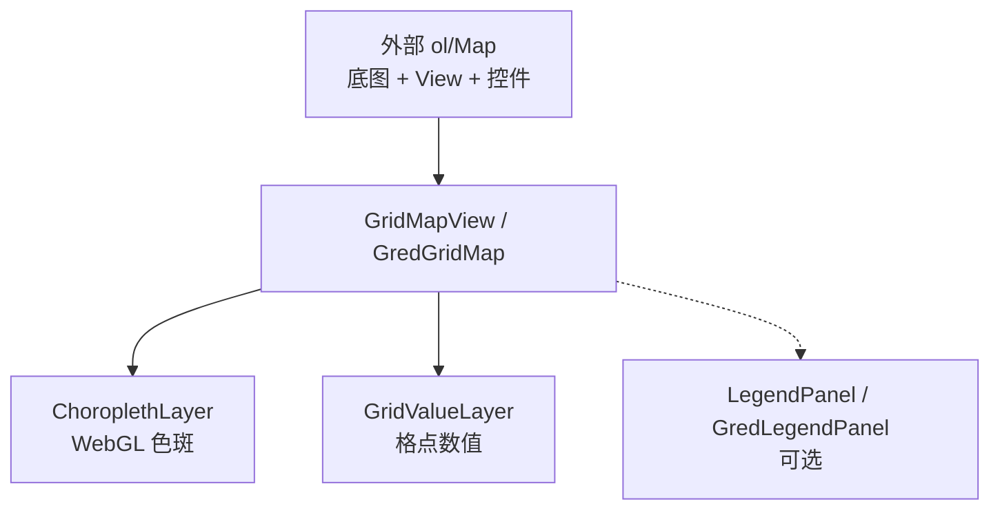

# grid-webgl-openlayers

> OpenLayers + WebGL 网格色斑图与格点数值标注。图层叠加在外部 `ol/Map` 上，不创建 Map、不管理底图。

[](LICENSE)

-4FC08D)


## 特性

- **外部 Map 叠加** — 底图、投影、控件由业务方管理
- **WebGL 色斑图** — LOD 降采样，支持不规则色带
- **Canvas2D 格点标注** — 按像素间距自动稀疏
- **图例双滑块** — 过滤显示数值区间（`blocks` / `gradient`）
- **鼠标拾取** — 悬停返回当前格点值
- **Vue 3 组件** — `GredGridMap`、`GredLegendPanel`（renderless 叠加层）

## 架构



## 安装

```bash
npm install grid-webgl-openlayers ol
npm install vue   # 仅 Vue 项目需要
```

```ts
import "ol/ol.css"
import "grid-webgl-openlayers/style.css"   // 使用图例面板时建议引入
```

## 快速开始

### 命令式

```ts
import Map from "ol/Map"
import View from "ol/View"
import { GridMapView } from "grid-webgl-openlayers"

const map = new Map({
  target: "map",
  view: new View({ projection: "EPSG:4326", center: [105, 30], zoom: 6 }),
  layers: [/* 你的底图 */],
})

const overlay = await GridMapView.create({
  map,
  dataUrl: "/data/arrayData.json",
})

overlay.onPointerMove(({ value }) => {
  if (value != null) console.log(value)
})
```

### Vue 3

```vue
<GredGridMap
  v-if="map"
  :map="map"
  data-url="/data/arrayData.json"
  @pointermove="onHover"
/>
```

```ts
import { GredGridMap, GredLegendPanel } from "grid-webgl-openlayers/vue"
```

## 📖 文档

完整操作手册见 **[docs/](./docs/README.md)**：

| 文档 | 说明 |
|------|------|
| [快速上手](docs/getting-started.md) | 使用前提、安装、功能一览 |
| [数据格式](docs/data-format.md) | `arrayData.json` 结构 |
| [命令式 API](docs/api-grid-map.md) | `GridMapView` 参数与方法 |
| [Vue 组件](docs/vue-components.md) | `GredGridMap` / `GredLegendPanel` |
| [图例与图层控制](docs/legend-and-controls.md) | 图例面板、双滑块、开关按钮 |
| [鼠标拾取](docs/pointer-pick.md) | 悬停返回值 |
| [投影切换](docs/projection.md) | EPSG:4326 ↔ 3857 |
| [色带配置](docs/color-ramp.md) | 不规则色带 |
| [示例合集](docs/examples.md) | 完整 Demo 代码 |
| [平台支持](docs/platform.md) | 浏览器 / 移动端 / Flutter |
| [构建发布](docs/build.md) | npm 打包与类型导出 |

## 本地预览

```bash
npm install
npm run dev          # http://localhost:5173 — 见 src/main.ts
```

Vue 示例：[`examples/vue-demo/App.vue`](examples/vue-demo/App.vue)

## License

MIT
